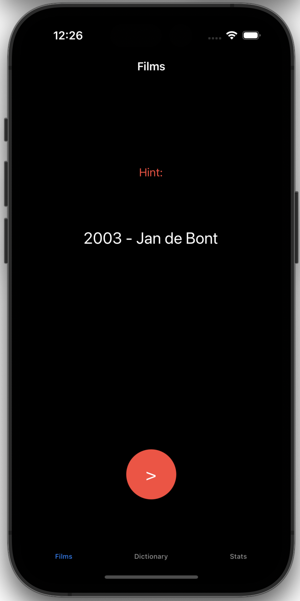
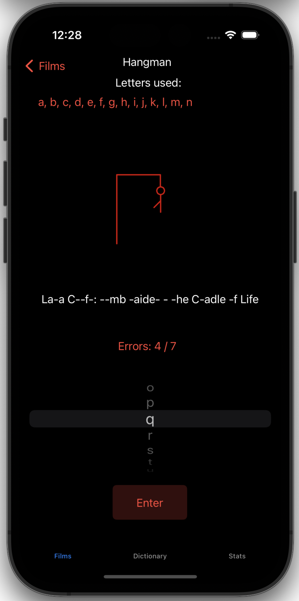
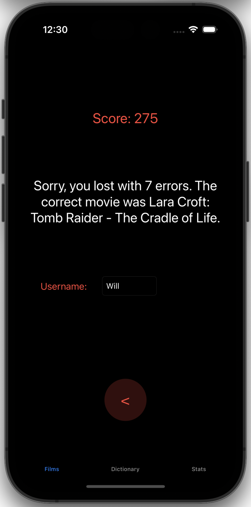
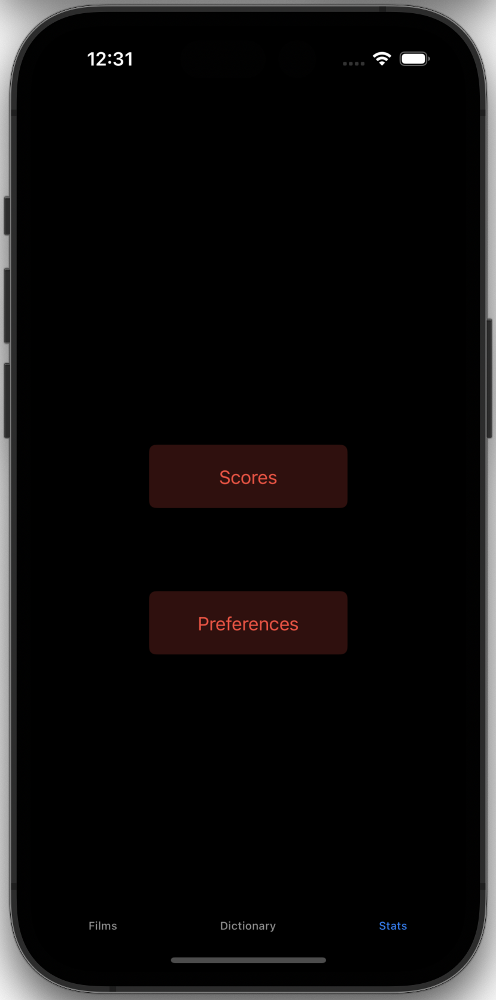
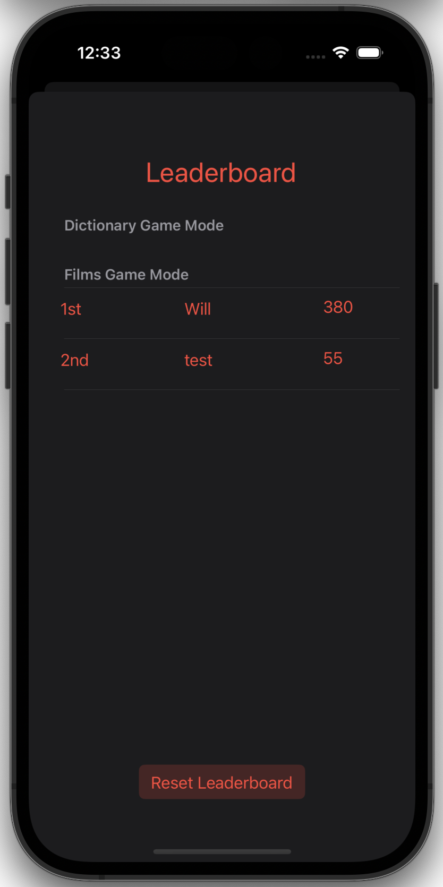
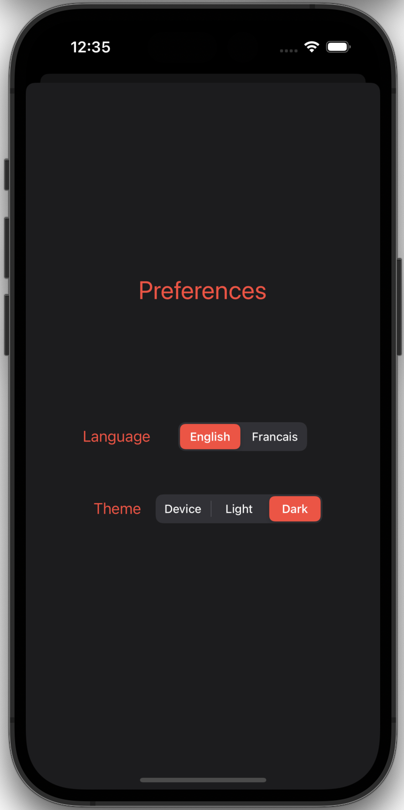

# 🧑‍💻 William Assaly

**`Mobile App Developer and Software Craftsman`**

Welcome to my GitHub profile! I specialize in creating intuitive and responsive mobile applications that provide users with an exceptional digital experience.

---
### 🛠️ Languages and tools

<!--
 -->
 

#

### 🚀 My Projects

### Hangman: [Project](https://github.com/WillAssaly/Hangman-IOS-Game)

<!-- Table for Technologies Used and the first row of images -->
<table style="width:100%; max-width:660px; border-collapse: collapse; margin: 0; padding: 0;" cellspacing="0" cellpadding="0">
  <tr>
    <td valign="top" style="width:30%;"> 
      <h3>Technologies Used</h3>
       <li>Swift</li>
        <li>UIKit</li>
        <li>Singleton Pattern</li>
        <li>MVC</li>
        <li>UserDefaults</li>
        <li>Core Data</li>
        <li>URLSession</li>
        <li>Codable</li>
        <li>UISegmentedControl</li>
        <li>Delegation Pattern</li>
        <li>UIImage</li>
    </td>
    <td>
      
      
      
    </td>
  </tr>
</table>

<!-- Spacing between the tables -->

<!-- Table for the second row of images -->
<table style="width:100%; max-width:660px; border-collapse: collapse; margin: 0; padding: 0;" cellspacing="0" cellpadding="0">
  <tr>
    <td style="text-align:center;">
      
      
      
    </td>
  </tr>
</table>

 
A brief description of what the project does and the technologies used. 

#### Project 2: [Project](link-to-project-repo)
<!--
Short explanation of the project, challenges faced, and solutions provided. -->

<!-- Repeat for additional projects -->

---

### 💡 Interested in
- Latest trends in mobile app development
- User experience design
- Augmented Reality (AR) app development
- Artificial Intelligence (AI)

<!-- Optional sections could include 'Certifications', 'Education', 'Testimonials', or 'Featured In'. -->

<!--
**WillAssaly/WillAssaly** is a ✨ _special_ ✨ repository because its `README.md` (this file) appears on your GitHub profile.

Here are some ideas to get you started:

- 🔭 I’m currently working on ...
- 🌱 I’m currently learning ...
- 👯 I’m looking to collaborate on ...
- 🤔 I’m looking for help with ...
- 💬 Ask me about ...
- 📫 How to reach me: ...
- 😄 Pronouns: ...
- ⚡ Fun fact: ...
-->
